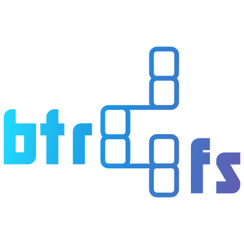

# Btrfs 介绍与相关操作

## Btrfs 介绍

Btrfs 是一种新型的写时复制（CoW）Linux 文件系统，已经并入内核主线。你可以读作 **B**e**t**te**r** **F**ile **S**ystem、**B**-**tr**ee **F**ile **S**ystem、**B**u**t**ter **F**ile **S**ystem 等等，都是正确的。Btrfs 在设计实现高级功能的同时，着重于容错、修复以及易于管理。它由 Oracle、Red Hat、Fujitsu、Intel、SUSE、STRATO 等企业和开发者共同开发。Btrfs 以 **GNU GPL** 协议授权，同时也欢迎任何人的贡献。

### Btrfs 的历史

- `2007` —— [甲骨文（Oracle）](https://www.oracle.com/cn/index.html) 宣布并开始研发
  - 对标 ZFS（开源社区对 ZFS 所作出的回应）
- `2010`
  - 在 SUSE Linux Enterprise Server 11 SP1（OpenSUSE 11）上技术预览
  - Btrfs 在 2010 年 10 月推出的 Ubuntu 10.10 中得到了应用
- `2011`
  - 2011 年 6 月 8 日，在 Fedora 工程指导委员会会议上，委员会决定 Fedora 16 将以 Btrfs 作为默认文件系统.
  - 2011 年 8 月 9 日，Fedora 撤回了决定，Btrfs 不再作为 Fedora 16 默认文件系统；原因是时间不充足，无法达到改变默认文件系统所要满足的基本要求
  - 2011 年 10 月 5 日，Fedora 16 测试版发布，BTRFS 将做为其默认文件系统
  - 2011 年 11 月 8 日，Fedora 16 正式版发布，默认文件系统依然采用 ext4，并未采用预计的 Btrfs 文件系统
- `2012` —— 在 SUSE Linux Enterprise Server 11 SP2（OpenSUSE 11）得到完整支持
- `2014` —— 在 SUSE Linux Enterprise Server 12（OpenSUSE 12）上作为默认文件系统
- `2018` —— 在 SUSE Linux Enterprise Server 15（OpenSUSE 15）上作为默认文件系统
- `2020` —— 2020 年 8 月 24 日，Btrfs 将取代 ext4 作为 Fedora 33 中的默认文件系统
- `2021` —— 在 SUSE MicroOS（OpenSUSE MicroOS）上作为默认文件系统

### Btrfs 的特性

> 带 ✅ 标记的是我们可以感受到的

#### 扩展性相关

1. B-tree
   - Btrfs 文件系统中所有的 metadata 都由 B-tree 管理。使用 B-tree 的主要好处在于查找、插入和删除操作都很高效。可以说 B-tree 是 Btrfs 的核心
2. 基于 Extent 的文件存储
3. ✅ 针对 SSD 的优化支持
   - Btrfs 的 CoW 技术从根本上避免了对同一个物理单元的反复写操作。如果用户打开了 SSD 优化选项，Btrfs 将在底层的块空间分配策略上进行优化：将多次磁盘空间分配请求聚合成一个大小为 2M 的连续的块。大块连续地址的 IO 能够让固化在 SSD 内部的微代码更好的进行读写优化，从而提高 I/O 性能
4. 动态 Inode 分配
5. 支持非常大的单个文件大小

#### 数据一致性相关

1. ✅ 写时复制（CoW）
   - 比就地修改的文件系统有更大的好处，详细的说明见下文
2. 校验和（Checksum）
   - 保证了数据的可靠性：由于硬件原因，从磁盘上读出的数据会出错。比如 block A 中存放的数据为 0x55，但读取出来的数据变成了 0x54，因为读取操作并未报错，所以这种错误不能被上层软件所察觉。解决这个问题的方法是保存数据的校验和，在读取数据后检查校验和。如果不符合，便知道数据出现了错误。如果最终从磁盘读取出来的数据和 checksum 不相同，Btrfs 会首先尝试读取数据的镜像备份，如果数据没有镜像备份，Btrfs 将返回错误。写入磁盘数据之前，Btrfs 计算数据的 checksum。然后将 checksum 和数据同时写入磁盘。

#### 多设备管理相关

1. ✅ 多设备管理
   - Btrfs 支持动态添加设备。用户在系统中增加新的磁盘之后，可以使用 `btrfs` 的相关命令将该设备添加到文件系统中
2. ✅ 子卷（Subvolume）
   - 把文件系统的一部分配置为一个完整的子文件系统
3. ✅ 快照（Snapshot）和克隆（Clone）
   - 支持快照
   - 支持快照的快照（增量备份）
   - 可以对单个文件进行备份
4. ✅ 内置支持 RAID，支持条带或 mirror 等常见的 RAID 功能
5. ✅ 支持热移除、热添加设备

#### 其他特性

1. ✅ 透明压缩
   - 减小了文件的大小，通过减少文件写入增幅来显著延长闪存介质的寿命。在某些特定的场景下（比如单线程、重负荷的文件 I/O）还提高了性能
2. 延迟分配（Delay allocation）
   - 在文件系统中，小块空间频繁的分配和释放会造成碎片。延迟分配则是这样一种技术 —— 当用户需要磁盘空间时，先将数据保存在内存中。将磁盘分配需求发送给磁盘空间分配器，磁盘空间分配器并不立即分配真正的磁盘空间。只是记录下这个请求便返回。磁盘空间分配请求可能很频繁，所以在延迟分配的一段时间内，磁盘分配器可以收到很多的分配请求 —— 一些请求也许可以合并，一些请求在这段延迟期间甚至可能被取消。通过这样的“等待”，往往能够减少不必要的分配，也有可能将多个小的分配请求合并为一个大的请求，从而提高 I/O 效率
3. Inline File
   - 系统中往往存在大量的小文件（几百个字节或者更小）。如果为其分配单独的数据 block，便会引起内部碎片，浪费磁盘空间。Btrfs 将小文件的内容保存在元数据中，不再额外分配存放文件数据的磁盘块。改善了内部碎片问题，也增加了文件的访问效率。得益于 Inline File 技术，Btrfs 处理小文件的效率非常高，也避免了磁盘碎片问题
4. 目录索引（Directory Index）
   - 当一个目录下的文件数目巨大时，目录索引可以显著提高文件搜索时间。 Btrfs 本身采用 B-tree 存储目录项，所以在给定目录下搜索文件的效率是非常高的。然而，Btrfs 使用 B-tree 管理目录项的方式无法同时满足 readdir 的需求。readdir 是 POSIX 标准 API，它要求返回指定目录下的所有文件；并且特别的，这些文件要按照 inode number 排序。而 Btrfs 目录项插入 B-tree 时的 Key 并不是 inode number，而是根据文件名计算的一个 hash 值。这种方式在查找一个特定文件时非常高效，但却不适于 readdir 。为此，Btrfs 在每次创建新的文件时，除了插入以 hash 值为 Key 的目录项外，还同时插入另外一种目录项索引，该目录项索引的 Key 以 sequence number 作为 B-tree 的键值。这个 sequence number 在每次创建新文件时线性增加。因为 Inode number 也是每次创建新文件时增加的，所以 sequence number 和 inode number 的顺序相同。以这种 sequence number 作为 Key 在 B-tree 中查找便可以方便的得到一个以 inode number 排序的文件列表
   - 另外以 sequence number 排序的文件往往在磁盘上的位置也是相邻的，所以以 sequence number 为序访问大量文件会获得更好的 I/O 效率
5. 预分配
   - 很多应用程序有预先分配磁盘空间的需要。他们可以通过 `posix_fallocate` 接口告诉文件系统在磁盘上预留一部分空间，但暂时并不写入数据。如果底层文件系统不支持 `fallocate`，那么应用程序只有使用 `write` 预先写一些无用信息以便为自己预留足够的磁盘空间。由文件系统来支持预留空间更加有效，而且能够减少磁盘碎片，因为所有的空间都是一次分配，因而更有可能使用连续的空间。 Btrfs 支持 `posix_fallocate`

### Btrfs 与其它文件系统功能比较

| Feature                       | Ext 2 / 3 | Ext 4   | ReiserFS | XFS     | OCFS2   | Btrfs      |
| ----------------------------- | --------- | ------- | -------- | ------- | ------- | ---------- |
| Journal (date / metadata)     | ⚫ / ⚫   | ⚫ / ⚫ | ⚪ / ⚫  | ⚪ / ⚫ | ⚪ / ⚫ | **N/A**    |
| Journal (internal / external) | ⚫ / ⚫   | ⚫ / ⚫ | ⚫ / ⚫  | ⚫ / ⚫ | ⚫ / ⚪ | N/A        |
| Offline extend / shrink       | ⚫ / ⚫   | ⚫ / ⚫ | ⚫ / ⚫  | ⚪ / ⚪ | ⚫ / ⚪ | ⚫ / ⚫    |
| Online extend / shrink        | ⚫ / ⚪   | ⚫ / ⚪ | ⚫ / ⚪  | ⚫ / ⚪ | ⚫ / ⚪ | ⚫ / ⚫    |
| Inode allocation map          | table     | table   | B\*-tree | B+-tree | table   | B-tree     |
| Sparse files                  | ⚫        | ⚫      | ⚫       | ⚫      | ⚫      | ⚫         |
| Tail packing                  | ⚪        | ⚫      | ⚫       | ⚪      | ⚪      | ⚫         |
| Defragmentation               | ⚪        | ⚫      | ⚪       | ⚫      | ⚪      | ⚫         |
| ExtArributes / ACLs           | ⚫ / ⚫   | ⚫ / ⚫ | ⚫ / ⚫  | ⚫ / ⚫ | ⚫ / ⚫ | ⚫ / ⚫    |
| Quotas                        | ⚫        | ⚫      | ⚫       | ⚫      | ⚫      | 🔴         |
| Dump / restore                | ⚫        | ⚫      | ⚪       | ⚫      | ⚪      | ⚪         |
| Default block size            | 4 KiB     | 4 KiB   | 4 KiB    | 4 KiB   | 4 KiB   | 4 KiB      |
| max. file system size         | 16 TiB    | 1 EiB   | 16 TiB   | 8 EiB   | 4 PiB   | **16 EiB** |
| max. file size                | 2 TiB     | 1 EiB   | 1 EiB    | 8 EiB   | 4 PiB   | **16 EiB** |
| Support status                | SLES      | SLES    | SLES     | SLES    | SLE HA  | SLES       |

### Btrfs 文件系统架构

### 理解写时复制（CoW）

## Btrfs 相关操作

> 📔 本节参考资料：
>
> 部分资料来自互联网（由于无法确认原作者，出处有待确认）
